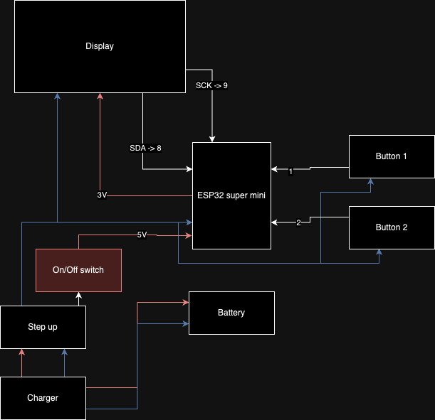

# ESP32 Pomodoro timer

## Needed Hardware

- ESP32 C3 Super Mini 3€
- On/Off Switch 40ct
- Screws + Insert 30ct
- TZT OLES IIC 0.96" 2€
- Loading board 5V Lithium Battery 1.8€
- Tactile Push Button 10ct
- 5V step up

## Wiring Diagram

## Resources

- [ESP32 Super Mini Pinout](https://forum.arduino.cc/t/esp32-c3-supermini-pinout/1189850)
- [YouTube Video](https://youtu.be/i4x8xYaKlNE)
- [Thingiverse Files](https://www.thingiverse.com/thing:6547679)